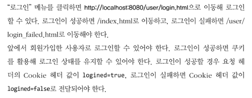

```java
public class Database {
    private static Map<String, User> users = new HashMap<String, User>();

    public static void addUser(User user){
        users.put(user.getUserId(), user);
    }

    public static User getUser(String userId){
        return users.get(userId);
    }
}
```
- HashMap으로 userId당 user 추가하기 
- 간단한 Database로 구현

```java
else if(url.startsWith("/user/login")) {
    Map<String, String> params = UserRequestParser.getParams(request.getBody());

    User user = Database.getUser(params.get("userId"));

    if(user == null){
        log.debug("User not found : {}", params.get("userId"));
        response302HeaderWithCookie(dos, "/user/login_failed.html", "logined=false");
    }else if(user.getPassword().equals(params.get("password"))){
        log.debug("Login Success");
        response302HeaderWithCookie(dos, "/index.html", "logined=true");
    }else{
        log.debug("Wrong password : {}", params.get("password"));
        response302HeaderWithCookie(dos, "/user/login_failed.html", "logined=false");
    }
}
```

```java
private void response302HeaderWithCookie(DataOutputStream dos, String location, String cookie) {
    try {
        dos.writeBytes("HTTP/1.1 302 Found \r\n");
        dos.writeBytes("Location: " + location + "\r\n");
        dos.writeBytes("Set-Cookie: " + cookie + "\r\n");
        dos.writeBytes("\r\n");
    } catch (IOException e) {
        log.error(e.getMessage());
    }
}
```


- 로그인이 성공하면 요청헤더에 Cookie 헤더 값에 logined=true하고 index.html로 리다이렉트


- 로그인이 실패하면 요청헤더에 Cookie 헤더 값에 logined=false하고 login_failed.html로 리다이렉트
