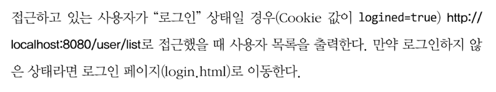
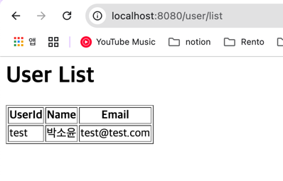

```java
if("GET".equals(request.getMethod())){
    if(request.getUrl().equals("/user/list")){
        handleUserList(request, dos);
    }else {
        doGet(request, dos);
    }
}
```
- 목록 출력이기 때문에 `GET` 일테니, `GET if` 문 내부에 넣어서 URL이 `/user/list`인지 확인
- 맞으면 `handleUserList()`, 아니면 원래 있던 `doGet()` 메서드 호출

```java
private void handleUserList(HttpRequest request, DataOutputStream dos) throws IOException {
    Map<String, String> cookies = request.getCookies();
    String logined = cookies.get("logined");

    log.info("로그인 여부 {} ", logined);

    if ("true".equals(logined)) {
        StringBuilder sb = new StringBuilder();
        sb.append("<html><body>");
        sb.append("<h1>User List</h1>");
        sb.append("<table border='1'>");
        sb.append("<tr><th>UserId</th><th>Name</th><th>Email</th></tr>");

        for (User user : Database.findAll()) {
            sb.append("<tr>")
                    .append("<td>").append(user.getUserId()).append("</td>")
                    .append("<td>").append(user.getName()).append("</td>")
                    .append("<td>").append(user.getEmail()).append("</td>")
                    .append("</tr>");
        }

        sb.append("</table>");
        sb.append("</body></html>");

        byte[] body = sb.toString().getBytes();
        response200Header(dos, body.length, request.getUrl());
        responseBody(dos, body);
    } else {
        response302Header(dos, "/user/login.html");
    }
}
```

```java
public static Collection<User> findAll() {
    return users.values();
}
```
- `Database` 클래스에 `findAll` 추가
 
```java
public Map<String, String> getCookies(){
    String cookieHeader = headers.get("Cookie");

    return HttpRequestUtils.parseCookies(cookieHeader);
}
```
- `HttpRequest` 클래스에 cookie 값을 가져오는 메서드를 생성
- `HttpRequestUtils`는 이미 존재하는 클래스임
- cookieHeader 예시) sessionId=abc123; theme=dark; loggedIn=true

---

아래는 `HttpRequestUtils` 클래스 코드

```java
public static Map<String, String> parseCookies(String cookies) {
    return parseValues(cookies, ";");
}
```
- 목적: HTTP 요청 헤더의 Cookie 값을 받아서 쿠키 이름과 값을 Map으로 변환
- 인자: cookies = "logined=true; sessionId=abc123" 같은 문자열이다
- 작동방식
  - 쿠키는 일반적으로 ; 으로 구분되므로, parseValues 메서드를 호출하고 구분자 ; 를 전달한다
- 결과
  - 쿠키 이름과 값을 Map<String, String> 형태로 반환한다
    - 예: {"logined"="true", "sessionId"="abc123"}

```java
private static Map<String, String> parseValues(String values, String separator) {
    if (Strings.isNullOrEmpty(values)) {
        return Maps.newHashMap();
    }

    String[] tokens = values.split(separator);
    return Arrays.stream(tokens).map(t -> getKeyValue(t, "=")).filter(p -> p != null)
            .collect(Collectors.toMap(p -> p.getKey(), p -> p.getValue()));
}
```
- 목적: 구분자로 나누어진 문자열(values)을 Map으로 변환한다
- 작동과정:
  - `Strings.isNullOrEmpty(values)` 체크
    - 문자열이 null이거나 빈 문자열이면 빈 Map 반환
  - `values.split(separator)`
    - 문자열을 구분자 기준으로 나눔
    - 예: "logined=true; sessionId=abc123" -> ["logined=true", " sessionId=abc123"]
  - `Arrays.stream(tokens)`
    - 배열을 Stream으로 변환
  - `.map(t -> getKeyValue(t, "="))`
    - 각 토큰을 "key=value" 형태로 분리
  - `.filter(p -> p != null)`
    - 잘못된 형식등은 제외
  - `.collect(Collectors.toMap(p -> p.getKey(), p -> p.getValue()))`
    - Stream을 Map으로 수집

+) 근데 생각해보면 header는
```text
GET /products?page=2&size=10 HTTP/1.1
Host: www.example.com
User-Agent: Mozilla/5.0 (Windows NT 10.0; Win64; x64) 
Accept: text/html,application/xhtml+xml,application/xml;q=0.9,*/*;q=0.8
Accept-Language: en-US,en;q=0.5
Accept-Encoding: gzip, deflate, br
Connection: keep-alive
Cookie: sessionId=abc123; theme=dark
```

이렇게 생겼는데 Cookie 쪽을 보면 두번째인 theme과 ; 사이에 spacebar가 한칸 들어가있음
<br>그렇게 되면 Map에 들어갈 때 key에 " theme" 이런식으로 들어가게 되지 않을까 하는 마음에 `trim`을 추가시켜 줌

```java
return Arrays.stream(tokens)
        .map(String::trim)
        .map(t -> getKeyValue(t, "="))
        .filter(p -> p != null)
        .collect(Collectors.toMap(p -> p.getKey(), p -> p.getValue()));
```
이런식으로 `.map(String::trim)`을 추가시켜 줌

---



결과!