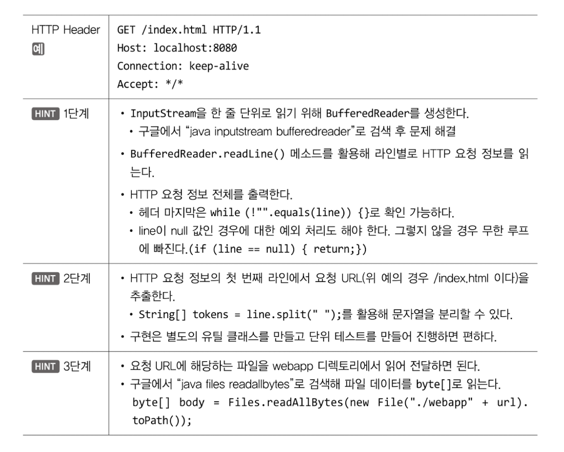

1단계

```java
public void run() {
        log.debug("New Client Connect! Connected IP : {}, Port : {}", connection.getInetAddress(),
                connection.getPort());

        try (InputStream in = connection.getInputStream(); OutputStream out = connection.getOutputStream()) {
            // TODO 사용자 요청에 대한 처리는 이 곳에 구현하면 된다.
            bf = new BufferedReader(new InputStreamReader(in));

            StringBuilder sb = new StringBuilder();
            String httpLines;

            while((httpLines = bf.readLine()) != null) {
                if(httpLines.isEmpty()) {
                    break;
                }
                sb.append(httpLines).append("\n");
            }

            log.debug("Full HTTP Request:\n{}", sb);

            DataOutputStream dos = new DataOutputStream(out);
            byte[] body = "Hello World".getBytes();
            response200Header(dos, body.length);
            responseBody(dos, body);
        } catch (IOException e) {
            log.error(e.getMessage());
        }
    }
```

**왜 BufferedStream을 사용하나요**

- `Socket.getInputStream()`은 바이트 스트림이어서 한 줄 단위로 처리하기 힘들다
- `InputStreamReader` 를 통해서 문자 스트림으로 변환하고, 다시 `BufferedReader` 로 감싸면 `readLine()`으로 편리하게 다시 읽을 수 있다

**HTTP 요청 라인 단위로 읽기**

- HTTP 요청은 \r\n 기준으로 구분된다
- `readLine()` 을 사용하면 한 줄씩 파싱한다
- 헤더가 끝났다는 신호는 **빈줄(””)이다**

**null 처리는 왜 하나요?**

- `readLine()`이 null을 반환한다는 건 클라이언트가 연결을 끊었다는 것을 의미
- 이를 체크하지 않으면 무한 루프에 빠질 수 있다

2단계

```java
public class HttpRequest {
    private static final Logger log = LoggerFactory.getLogger(HttpRequest.class);

    public void getUrl(BufferedReader reader) throws IOException {
        String http = reader.readLine();

        if(http == null) {
            throw new IOException("Not Found");
        }

        String[] tokens = http.split(" ");
        log.debug("요청 URL은 {}입니다.", tokens[1]);
    }
}

//RequestHandler class
HttpRequest request = new HttpRequest();
request.getUrl(bf);

StringBuilder sb = new StringBuilder();
String httpLines;

while((httpLines = bf.readLine()) != null) {
    if(httpLines.isEmpty()) break;
                
    sb.append(httpLines).append("\n");
}
```

처음에는 저렇게 getUrl() 메서드로 했는데 찾아보니 생성자로 많이 만들길래 수정함

```java
public class HttpRequest {
    String url;
    StringBuilder fullHttpRequest = new StringBuilder();

    public HttpRequest(BufferedReader reader) throws IOException{
        String http = reader.readLine();

        if(http == null) {
            throw new IOException("Not Found");
        }

        String[] tokens = http.split(" ");
        url = tokens[1];

        String httpLines;
        while((httpLines = reader.readLine()) != null) {
            if(httpLines.isEmpty()) {
                break;
            }

            fullHttpRequest.append(httpLines).append("\n");
        }
    }

    public String getUrl(){
        return url;
    }

    public String getFullHttpRequest(){
        return fullHttpRequest.toString();
    }
}
```

```java
public void run() {
        log.debug("New Client Connect! Connected IP : {}, Port : {}", connection.getInetAddress(),
                connection.getPort());

        try (InputStream in = connection.getInputStream(); OutputStream out = connection.getOutputStream()) {
            // TODO 사용자 요청에 대한 처리는 이 곳에 구현하면 된다.
            bf = new BufferedReader(new InputStreamReader(in));
            HttpRequest request = new HttpRequest(bf);

            log.debug("요청 URL은 {}입니다.", request.getUrl());
            log.debug("전체 HTTP 요청은:\n{}\n입니다", request.getFullHttpRequest());

            DataOutputStream dos = new DataOutputStream(out);
            byte[] body = "Hello World".getBytes();
            response200Header(dos, body.length);
            responseBody(dos, body);
        } catch (IOException e) {
            log.error(e.getMessage());
        }
    }
```

이렇게 생성자에서 처리하면 좋은점(by 제미나이)

### 1. 객체지향 원칙: 단일 책임 원칙 (SRP)

`HttpRequest` 클래스는 HTTP 요청에 대한 정보를 **담는 역할**을 해야 합니다. 첫 번째 코드처럼 `getUrl(BufferedReader reader)` 메서드에서 요청을 읽고 URL을 파싱하는 로직이 있으면, `HttpRequest`는 "요청을 파싱하는 행위"와 "요청 정보를 담는 역할" 두 가지를 하게 됩니다.

반면에 두 번째 코드에서는 생성자 `HttpRequest(BufferedReader reader)`가 HTTP 요청을 읽고 필요한 정보를 파싱하는 **초기화 작업**을 담당합니다. 그 결과, `HttpRequest` 객체는 URL, 전체 요청 전문 등 HTTP 요청의 정보를 온전히 담고 있는 **상태**가 됩니다. 이후 `getUrl()` 같은 메서드는 단순히 이미 파싱된 정보를 반환하는 역할만 하게 되죠.

이렇게 하면 `HttpRequest` 클래스의 책임이 명확해지고, 코드의 가독성과 유지보수성이 높아집니다.

### 2. 코드의 역할 분리 및 재사용성

두 번째 코드처럼 생성자에서 모든 파싱 작업을 완료하면, `HttpRequest` 객체는 완성된 상태로 다른 곳에 전달될 수 있습니다. 예를 들어, `getUrl()`은 요청을 읽는 `BufferedReader` 없이도 언제든지 URL을 반환할 수 있습니다.

**왜 BufferedReader 사용하려면 IOException을 포함해야하는가?**

**log.debug 파라미터 넣기**

```java
//log.debug("요청 URL은 " + tokens[1] + "입니다."); 
log.debug("요청 URL은 {}입니다.", tokens[1]);
```

요청이 index.html이랑 favicon.ico 두번 발생하는 상황 발생

- 브라우저는 기본적으로 `/favicon.ico`를 자동으로 요청하기 때문에 발생
- 그래서 favicon 요청시 그냥 Error 터지게 함

```java
if("/favicon.ico".equals(url)) {
    throw new IOException("Favicon 요청 무시하기");
}
```

- 혹은 `./webapp/favicon.ico` 에 아이콘 파일을 둬도 됨

3단계

```java
byte[] bytes = Files.readAllBytes(new File("./webapp" + request.getUrl()).toPath());
log.debug("요청 URL에 해당하는 파일은: {}입니다.", new String(bytes));
```

그럼 index.html 파일을 쭉 읽어서 로그에 나옴