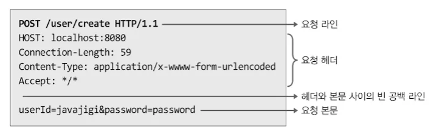
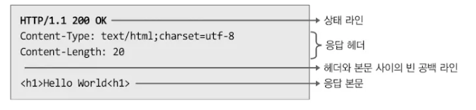
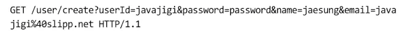
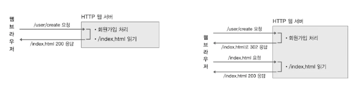
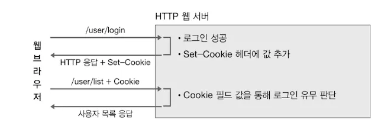

- 서버는 각 요청에 대해 순차적으로 실행하는 것이 아니라 동시에 각 요청에 대응하는 스레드를 생성해 동시에 실행한다

- 요청 데이터에 첫 번째 라인: 요청 라인(Request Line) ← 필수
    - “HTTP-메서드 URI HTTP-버전” 으로 구성
    - HTTP 메서드: 요청의 종류
    - URI: 클라이언트가 서버에 유일하게 식별할 수 있는 요청 자원의 경로
    - HTTP-버전: 현재 요청의 HTTP 버전
- 두번째 라인부터 공백라인까지: 요청 헤더(Request Header) ← 필수
    - <필드 이름> : <필드 값> 쌍으로 이루어져있다
    - 하나의 필드이름에 여러 가지 필드 값을 전달하고 싶으면 쉼표(,) 구분자 사용
- 빈 공백 문자열 다음부터 본문(body) 데이터 전송 ← 필수X

서버는 클라이언트 요청에 대한 응답을 해야함!

- 첫 번째 라인: 상태 라인(Status)
    - “HTTP-버전 상태코드 응답구문” 으로 구성
    - HTTP-버전: 현재 요청의 HTTP 버전
    - 상태코드: 응답에 대한 상태를 의미하는 코드 값
- 두 번째 라인~공백라인: 응답 헤더(Header)
- 공백라인~: 본문(Body) 데이터

---

### 3.4.3.1 index.html 가져오기

index.html 파일 가져올 때 console을 보면 `/index.html`요청을 한번 보냈는데 여러 개의 추가 요청이 발생함

이유는?

- 서버가 웹 페이지를 구성하는 모든 자원(HTML, CSS, 자바스크립트, 이미지 등)을 한번에 응답으로 보내지 않아서
- 웹 서버는 첫 번째로 `/index.html` 요청에 대한 응담에 HTML만 보냄
- 응답을 받은 브라우저는 HTML 내용을 분석해 CSS, 자스, 이미지 등의 자원이 포함되어 있으면 서버에 해당 자원을 다시 요청보냄
- ⇒ 따라서 하나의 웹 페이지를 사용자에게 정상적으로 서비스하려면 클라이언트와 서버 간에 한 번의 요청이 아닌 여러 번의 요청과 응답을 주고 받게 된다

---

### 3.4.3.2 GET 요청으로 회원가입

- GET 요청으로 보낼 경우, 사용자가 입력한 값을 물음표 뒤에 `매개변수명1=값1&매개변수명2=값2` 형식으로 전송
- `/user/create`는 요청 자원의 위치를 나타내는 경로(path)
- 물음표 뒤에 전달되는 매개변수를 쿼리 스트링(query string)

GET 방식으로 사용자가 입력한 데이터를 전달하는 데 몇 가지 문제점이 있음

1. 사용자가 입력한 데이터가 브라우저 URL 입력창에 표시
    1. 비번까지 URL에 노출되어서 보안 측면에 좋지 않음
2. 요청 라인의 길이에 제한이 있음
    1. 사용자가 입력할 수 있는 데이터 크기에 제한이 생김

⇒ 따라서 GET 방식은 사용자가 입력한 데이터를 서버에 전송해 데이터를 추가할 때는 적합하지 않음

⇒ 그래서 HTTP는 POST 방식을 지원

---

### 3.4.3.3 POST 요청으로 회원가입

- POST 방식으로 요청을 보내면 쿼리스트링은 **HTTP 요청의 본문(body)** 를 통해 전달됨
- POST 방식으로 데이터를 전달하면서 헤더에 본문 데이터에 대한 길이가 `Content-Length`라는 필드 이름으로 전달

? **궁금한점**

왜 Content-Length 만큼만 읽어야하나? 더 읽으면 무슨 일이 생기나?

1. 요청과 응답을 구분하기 위해
    1. HTTP는 TCP 위에서 동작하기 때문에, 데이터가 하나의 스트림처럼 연속적으로 들어온다
    2. Content-Length 없이 무작정 `read()`하면, 현재 요청의 `body`와 다음 요청의 시작 라인이 섞여서 읽히는 문제 발생
2. 연결이 끊길 때까지 읽으면 비효율적
    1. Content-Length 없이 계속 읽으려면 TCP 연결이 끊길 때까지 대기해야함
    2. 근데 POST는 대부분 Keep-Alive 연결을 사용해서, 연결은 계속 열려 있고 서버는 무한 대기 상태에 빠질 수 있음
3. 메모리 안전성 문제 방지
    1. 본문 전체를 읽으면 큰 데이터를 계속 읽어 메모리가 부족해질 수 있음

---

HTML은 기본적으로 GET, POST 메서드만 지원한다

GET과 POST 중 어떨 때 어떤 걸 사용하나

`GET`

1. 서버에 존재하는 데이터(또는 자원)를 가져오는 것
2. **데이터를 조회하는 역할**

`POST`

1. 서버에 요청을 보내 데이터 추가, 수정, 삭제와 같은 작업
2. **데이터의 상태를 변경하는 작업**

---

### 3.4.3.4 index.html로 리다이렉트

- 회원가입을 처리하는 `/user/create` 요청과 첫 화면(`/index.html`)을 보여주는 요청을 분리한 후 HTTP의 302 상태 코드를 활용해 해결할 수 있다
- `index.html` 로 이동하도록 응답을 보낼 때 사용하는 응답 헤더는 Location으로 다음과 같이 응답을 보냄

- 클라이언트는 첫 라인의 상태 코드를 확인한 후 302라면 Location의 값을 읽어 서버에 재요청을 보냄

- 302 상태 코드를 활용해 페이지를 이동할 경우 요청과 응답이 한 번이 아니라 두 번 발생한다

**상태 코드**

- 2XX: 성공. 클라이언트가 요청한 동작을 수신하여 이해했고 승낙했으면 성공적으로 처리
- 3XX: 리다이렉션. 클라이언트는 요청을 마치기 위해 추가 동작이 필요함
- 4XX: 요청 오류. 클라이언트에 오류가 있음
- 5XX: 서버 오류. 서버가 유효한 요청을 명백하게 수행하지 못함

---

### 3.4.3.5 로그인하기

- HTTP는 요청을 보내고 응답을 받으면 클라이언트와 서버 간의 연결을 끊는다
- **이와 같이 클라이언트와 서버 간의 연결을 끊기 때문에 각 요청 사이에 상태를 공유할 수 없다 → 이래서 HTTP를 무상태 프로토콜이라고 함**
- HTTP가 무상태 프로토콜이기 때문에 서버는 클라이언트가 누구인지 식별할 수 있는 방법이 없다!
- → **이걸 지원하는 것이 쿠키(Cookie)이다**

예시) 서버에 로그인 요청 → 로그인 성공/실패 여부에 따라 응답 헤더에 `Set-Cookie` 로 결과 값 저장 → 클라이언트는 응답 헤더에 `Set-Cookie` 가 존재할 경우, 값을 읽어 서버에 보내는 요청 헤더의 `Cookie`헤더 값으로 다시 전송

⇒ HTTP는 각 요청 간에 데이터를 공유할 방법이 없기 때문에 헤더를 통해 공유할 데이터를 매번 다시 전송하는 방식으로 데이터를 공유

---

### 3.4.3.6 사용자 목록읽기

- 서버가 전달하는 쿠키 정보는 클라이언트에 저장해 관리하기 때문에 보안 이슈가 있다
- 이 같은 단점을 보완하기 위해 “세션”이 등장!
    - 상태 데이터를 서버에 저장함

---

### 3.4.3.7 CSS 적용

브라우저는 응답을 받은 후 Content-Type 헤더 값을 통해 응답 본문(body)에 포함되어 있는 컨텐츠가 어떤 컨텐츠인지를 판단한다

근데 응답을 보낼 때 모든 컨텐츠 타입을 `text/html`로 보내기에 CSS를 HTML로 인식하여 정상적으로 동작을 안함

⇒ 해결법: Content-Type 값을 요청마다 다르게 나누기

각 요청과 응답 헤더는 각 요청과 응답이 포함하고 있는 본문 컨텐츠에 대한 정보를 제공하고 있다 = 메타데이터