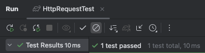

- 설계를 한 번만 해야한다는 생각은 노노
- 프로젝트 요구사항에 대한 지식이 높아질수록 더 좋은 설계를 할 수 있으며, 더 깔끔한 코드를 구현할 수 있다
- **설계는 한 번의 작업으로 끝내는 것이 아니라, 애플리케이션을 개발하고 배포해 운영하는 동안 끊임없이 진행해야 하는 것**
  - 이와 같이 **지속적인 설계와 구현을 잘 할 수 있는 방법이 지속적인 리팩토링**이다
  - **리팩토링은 설계를 개선하기 위한 일련의 활동**

리팩토링을 잘하는 방법
1. 다른 개발자가 구현한 많은 코드 읽기
2. 소스코드를 직접 구현해보기
   3. 더 이상 리팩토링이 필요없다고 판단될 때까지 극단적으로 연습해보기

### 5.1.2 리팩토링 1단계 힌트

```java
@Test
public void request_GET() throws Exception{
    InputStream inputStream = new FileInputStream(new File(testDirectory + "Http_GET.txt"));

    HttpRequest request = new HttpRequest(inputStream);

    assertEquals("GET", request.getMethod());
    assertEquals("/user/create", request.getPath());
    assertEquals("keep-alive", request.getHeader("Connection"));
    assertEquals("soyun", request.getParameter("userId"));
}
```
**위 테스트 코드에 맞춰서 HttpRequest 바꾸기 시작**
<br>

`public HttpRequest(InputStream in) throws IOException`

- HttpRequest 클래스에 InputStream을 전달하는 걸로 바꾸기

```java
private void parseRequestLine(String requestLine) throws IOException {
    String[] tokens = requestLine.split(" ");
    if (tokens.length < 2) throw new IOException("Invalid Request line");

    this.method = tokens[0];

    int index = tokens[1].indexOf('?');
    this.path = (index == -1) ? tokens[1] : tokens[1].substring(0, index);

    if (index != -1) {
        parseParams(tokens[1].substring(index + 1));
    }
}
```
- 원래는 url이랑 queryString을 `UserParserRequest`라는 클래스에서 파싱했는데 HttpRequest로 수정
- 똑같이 '?'가 없으면 queryString이 없는거기에 path만 저장하고, 있으면 path는 url만(/user/create) 같이만 저장함 남은 부분은 queryString은 parseParams 메서드를 통해서 Map으로 저장

```java
public String getPath() {
    return path;
}
```
- `getUrl()` 메서드를 `getPath()`로 이름 바꾸기

```java
public String getHeader(String name) {
    return headers.get(name);
}
```
- 원래는 Map 형태의 Header를 반환했지만, String으로 key값 넘겨주면 value 값 넘겨주는 걸로 바꿈

```java
    private void parseBody() throws IOException {
    if (headers.containsKey("Content-Length")) {
        int length = Integer.parseInt(headers.get("Content-Length"));
        body = IOUtils.readData(reader, length);

        parseParams(body);
    }
}
```
- body가 있을 경우(Post일 경우), body를 넘겨주면서 똑같이 Map에 넣기

```java
public String getParameter(String name) {
    return params.get(name);
}
```
- body가 있을 경우, map에 저장된 parameter value 값을 key 값으로 가져오기


- 테스트 성공~